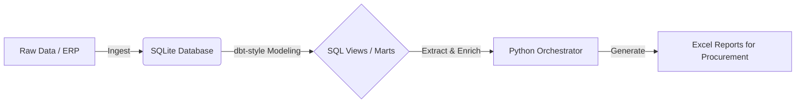

# 📦 Automated Inventory Risk Pipeline

**A resilient ELT pipeline designed to detect stockouts and optimize capital allocation in warehouse environments.**


## 🚀 Business Case
In high-frequency logistics, "Stockouts" (OOS) directly translate to lost revenue and stalled production lines. 
This project moves away from manual Excel handling to an **automated Data Engineering solution**.

It answers two critical questions:
1.  **Risk Management:** Which items are currently below the safety stock threshold?
2.  **Capital Commitment:** How much capital is tied up in specific storage locations ("Dead Stock Analysis")?

## 🏗️ Architecture

The system follows a modern **ELT (Extract, Load, Transform)** pattern with clear separation of concerns:


🛠️ Installation & Usage
1. Prerequisites

    Python 3.10+

    SQLite3

2. Setup Infrastructure

Initialize the database schema and load dummy data:
```
# Clean install of the database (Tables & Data)
# Open DBeaver or run via CLI
sqlite3 data/logistik_playground.db < setup/01_setup_schema.sql
sqlite3 data/logistik_playground.db < setup/02_insert_dummy_data.sql
```
3. Deploy Business Logic
```
Deploy the View Layer (Schema Migration):
python scripts/init_db_views.py
```
4. Run the Pipeline
```
Generate the daily risk report:
Bash

python scripts/db_connection.py
```
Output: reports/dispo_bericht.xlsx will be generated.
📈 Key Learnings & Patterns

    Idempotency: Scripts can be re-run multiple times without causing data duplication or crashes (DROP VIEW IF EXISTS).

    Modularization: Business logic is decoupled from the execution layer.

    Physical Grounding: Data constraints reflect physical realities (e.g., distinct storage locations).

